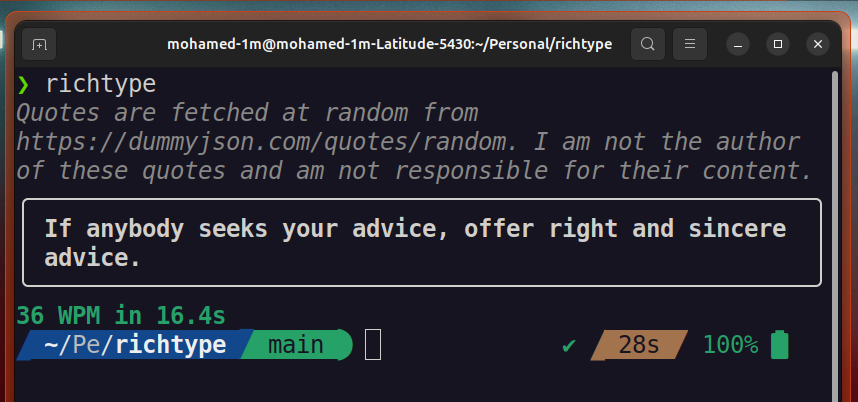

# richtype

A terminal typing-speed game built with [`rich`](https://github.com/Textualize/rich).

A random quote is fetched as your target text; type it as fast and accurately as
you can and richtype reports your words-per-minute on completion.



## Install & run

This project uses [`uv`](https://docs.astral.sh/uv/).

Run it straight from the repo:

```bash
uv run richtype
```

Or install it as a `richtype` command on your system:

```bash
# from a clone of this repo
uv tool install .

# ...or straight from GitHub, no clone needed
uv tool install git+https://github.com/MohamedGacha/richtype
```

Then just run `richtype` from anywhere. (Update later with `uv tool upgrade
richtype`, remove with `uv tool uninstall richtype`.)

## Controls

| Key          | Action                          |
| ------------ | ------------------------------- |
| _any char_   | type the next character         |
| `Backspace`  | delete the last character       |
| `Ctrl+R`     | restart and fetch a new quote   |
| `Esc`        | quit                            |

Correct characters render in white, mistakes in red underline, and untyped text
is dimmed. On completion you get your **WPM** and elapsed time.

## Multiplayer (WIP)

I'm playing with a FastAPI WebSocket server in `src/server/` to let two people
race the same quote. It's not done yet (the `READY` flag is still `False`), so
for now just use the CLI.

## License

[MIT](LICENSE) © Mohamed GACHA
